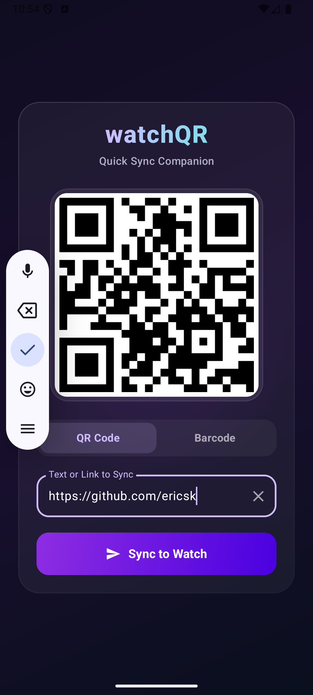
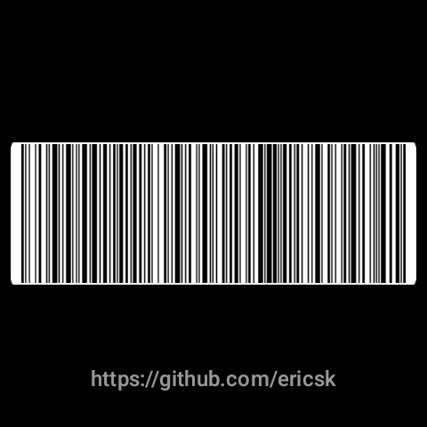
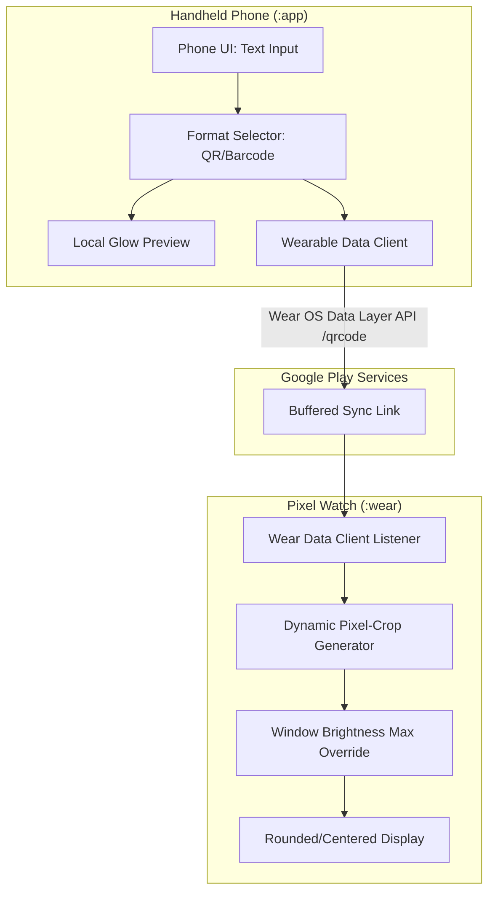

# watchQR

`watchQR` is a premium, high-performance Android & Wear OS companion application pair built with Native Kotlin and Jetpack Compose. It allows users to input data on an Android phone, instantly synchronize it offline via the Google Play Services Wearable Data Layer, and render high-contrast scannable codes (QR Codes and 1D Barcodes) locally on a Wear OS smartwatch (e.g., Pixel Watch).

---

## 🌟 Key Features

* **Dual Format Support**: Dynamically choose between 2D QR Codes and 1D Barcodes (Code 128) based on your use case (e.g., payment, ticketing, URL sharing).
* **Modern Premium UI**: 
  * Handheld companion app features a dark theme layout with glassmorphic cards, custom gradient accents, and live previews.
  * Wear OS app features circular screen optimizations to prevent text/code clipping.
* **Offline Synchronization**: Powered by the Wear OS Data Layer API (`/qrcode` path). Synced items are buffered and delivered even when offline, automatically syncing as soon as the watch connects.
* **Local Code Generation**: Codes are generated locally on the smartwatch using the ZXing Core library, minimizing battery usage and Bluetooth bandwidth.
* **Scan Optimizations**:
  * **Ultra-Thin White Borders**: Custom pixel-cropping algorithms remove default padding from ZXing outputs, maximizing the size of code bars/matrices.
  * **Safe-Zone Margins**: QR codes are centered at 165dp with 3dp borders to prevent corner clipping on round screens. 1D Barcodes are stretched to 95% width with 6dp horizontal margins for standard reader compatibility.
  * **Temporary High Brightness**: Screen brightness is automatically pushed to 100% when displaying a barcode on the watch to ensure immediate scanner readability, and restored to the system default once closed or minimized.

---

## 📸 Screenshots

### Android Phone Companion App

| QR Code Mode (280dp Square Preview) | Barcode Mode (Dynamic Banner Preview) |
| :---: | :---: |
|  |  |

### Wear OS App



---

## 🏗️ Architecture & Collaboration Model

This codebase consists of a root project with a multi-module Gradle layout:
* `:app` - Handheld companion mobile application.
* `:wear` - Wear OS watch application.



---

## 🛠️ Prerequisites & Setup

* **Android SDK**: Compile SDK 36, Target SDK 36, Min SDK 24 (Phone) / 30 (Wear OS).
* **Build System**: Gradle 9.0+ / Kotlin 2.3+
* **Dependencies**: 
  * Google Play Services Wearable (`com.google.android.gms:play-services-wearable`)
  * ZXing Core (`com.google.zxing:core`)
  * Jetpack Compose & Compose for Wear OS

---

## 🚀 How to Run and Test

### 1. Build the APKs
From the command line, run:
```bash
./gradlew assembleDebug
```
This generates:
* Mobile APK: `app/build/outputs/apk/debug/app-debug.apk`
* Watch APK: `wear/build/outputs/apk/debug/wear-debug.apk`

### 2. Launch Emulators / Devices
Ensure you have a phone emulator (e.g. `medium_phone`) with Google Play Store support and a Wear OS watch emulator (e.g. `Pixel_Watch_3`). 

Start them from CLI or Android Studio:
```bash
android emulator start medium_phone
android emulator start Pixel_Watch_3
```

### 3. Pair the Emulators (Crucial!)
Because the Wearable Data Layer relies on system-level pairing to transfer data:
1. Open **Android Studio** and load the project.
2. Open the **Device Manager** tool window.
3. Click the overflow menu (three dots) next to either emulator and choose **Pair Wearable**.
4. Follow the **Wear OS Emulator Pairing Assistant** to link the devices. Android Studio will automatically install the Wear OS companion services on the phone emulator to resolve GMS connection errors (e.g., `failed 17`).

### 4. Deploy the Apps
Use `adb devices` to check the serial IDs of your running emulators (typically `emulator-5554` for the first device, `emulator-5556` for the second).

Deploy the mobile app to the phone and the Wear app to the watch:
```bash
# Install to Phone (Replace <phone-device-id> with actual ID, e.g., emulator-5554)
adb -s <phone-device-id> install -r ./app/build/outputs/apk/debug/app-debug.apk
# Install to Watch (Replace <watch-device-id> with actual ID, e.g., emulator-5556)
adb -s <watch-device-id> install -r ./wear/build/outputs/apk/debug/wear-debug.apk

# Launch Phone App
adb -s <phone-device-id> shell am start -n org.ericsk.android.watchQR/org.ericsk.android.watchQR.MainActivity
# Launch Watch App
adb -s <watch-device-id> shell am start -n org.ericsk.android.watchQR/org.ericsk.android.watchQR.MainActivity
```

---

## 📄 License

This project is licensed under the Apache License, Version 2.0 (the "License"). You may obtain a copy of the License in the [LICENSE](./LICENSE) file or at:

http://www.apache.org/licenses/LICENSE-2.0

Unless required by applicable law or agreed to in writing, software distributed under the License is distributed on an "AS IS" BASIS, WITHOUT WARRANTIES OR CONDITIONS OF ANY KIND, either express or implied. See the License for the specific language governing permissions and limitations under the License.
