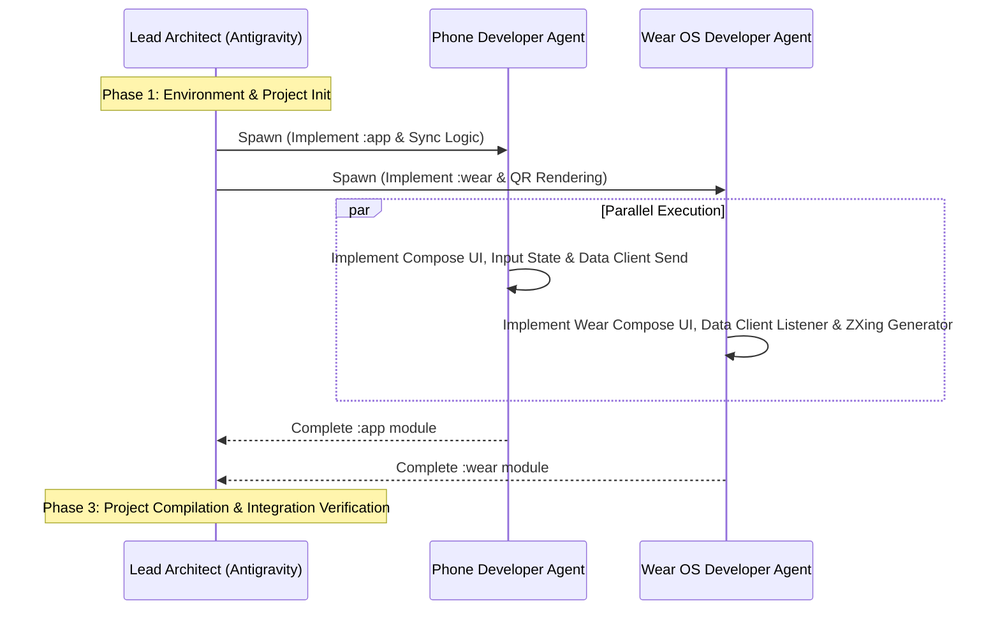

# Project Specification & Multi-Agent Collaboration Architecture

This document defines the technical specifications, system architecture, and the multi-agent orchestration plan for building the **watchQR** Android and Wear OS companion applications.

---

## 1. Technical Specifications

### 1.1 System Architecture Overview

```mermaid
graph TD
    subgraph Handheld Phone (:app)
        A[Phone UI: Text Input] --> B[Local QR Preview]
        A --> C[Wearable Data Client]
    )
    subgraph Google Play Services
        C -->|Wear OS Data Layer API /qrcode| D[Buffered Local Sync]
    end
    subgraph Pixel Watch (:wear)
        D --> E[Wear Data Client Listener]
        E --> F[Watch Local QR Generator]
        F --> G[Wear UI: Rounded QR Display]
    end
```

### 1.2 Tech Stack
* **Language**: Kotlin
* **Handheld UI**: Jetpack Compose with Material 3
* **Wear OS UI**: Jetpack Compose for Wear OS with Material (optimized for round screens)
* **SDK Compatibility**:
  * Handheld: `minSdk = 24`, `targetSdk = 36`
  * Wear OS: `minSdk = 30` (Wear OS 3.0+), `targetSdk = 36`
* **Communication Link**: Google Play Services Wearable Data Layer (`com.google.android.gms:play-services-wearable`)
* **QR Generation Library**: ZXing Core (`com.google.zxing:core`)

### 1.3 Communication Protocol
* **Data Item Path**: `/qrcode`
* **Payload Structure**:
  ```json
  {
    "text": "String value of input data"
  }
  ```
* **Sync Configuration**: Urgent delivery enabled (`setUrgent()`) to minimize delay.

---

## 2. Multi-Agent Orchestration Architecture

To expedite implementation, we will use three specialized agents working concurrently.



### 2.1 Agent Roles and Tasks

#### Agent A: Lead Architect (Main Agent / Antigravity)
* **Responsibility**: Project initialization, dependency management, shared build scripts, and final integration.
* **Outputs**:
  * Root `settings.gradle.kts`
  * Root `build.gradle.kts`
  * `gradle/libs.versions.toml`
* **Validation**: Run `./gradlew assembleDebug` and inspect build artifacts.

#### Agent B: Phone Developer Agent (Subagent)
* **Responsibility**: Implement the phone companion application (`:app` module).
* **Outputs**:
  * `app/build.gradle.kts`
  * `app/src/main/java/com/example/watchqr/MainActivity.kt` (Phone UI & sync action)
  * QR Code preview renderer helper on the phone side.

#### Agent C: Wear OS Developer Agent (Subagent)
* **Responsibility**: Implement the watch application (`:wear` module).
* **Outputs**:
  * `wear/build.gradle.kts`
  * `wear/src/main/AndroidManifest.xml` (including Wear OS hardware tags)
  * `wear/src/main/java/com/example/watchqr/MainActivity.kt` (Wear OS UI, Data Layer listener, and local ZXing bitmap generator)

---

## 3. Data Synchronization Flow Details

### 3.1 Handheld (Sender) Implementation
When the user clicks "Sync to Watch" (同步至手錶):
1. Retrieve the text string from the Compose input field.
2. Build a `PutDataMapRequest` with path `/qrcode`.
3. Put the string into the map with key `"text"`.
4. Set urgency: `asPutDataRequest().setUrgent()`.
5. Call `Wearable.getDataClient(context).putDataItem(...)` and listen for success/failure.

### 3.2 Wear OS (Receiver) Implementation
1. **Startup Check**: On launch (`onResume`), query the DataClient for existing `/qrcode` DataItems to display the most recently synced value immediately.
2. **Real-time Listener**: Implement `DataClient.OnDataChangedListener` to listen to `/qrcode` path changes dynamically.
3. **Local Render**:
   - Extract string from the event.
   - Run ZXing generator to build a 2D bit matrix.
   - Convert matrix to Bitmap and render inside a white square box with round-screen safe padding.
